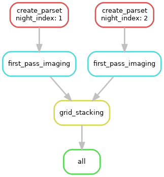

# Grid stacking pipeline for beam17
----

This pipeline gets `N` nights from beam 17 as an input and creates the shallow images & grids. The grids created are stacked togeter and the deep staked grid is imaged using an image-domain based deconvolution.

_Note_: the input MS should be only a handful of channels, otherwise additional parallelisation by spectral windows have to be included!

An example graph of the pipeline: 