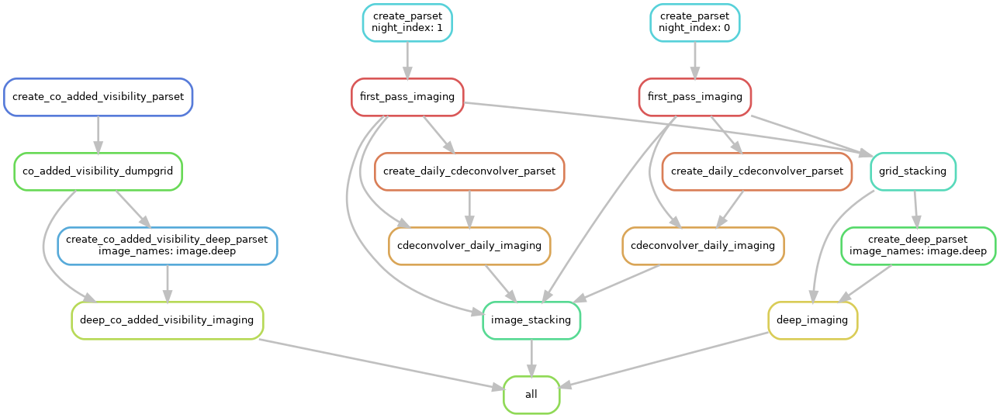

# Grid stacking pipeline for beam17
----

This pipeline gets `N` nights from beam 17 as an input and creates the shallow images & grids. The grids created are stacked togeter and the deep staked grid is imaged using an image-domain based deconvolution.

_Note_: the input MS should be only a handful of channels, otherwise additional parallelisation by spectral windows have to be included!

There are two Snakemake scripts included. ``serial_Snakemake`` is the serial version of the piepline and should be run by the command ``snakemake -s serial_Snakemake --cores x``. While the HPC-version of the pieline is the default ``Snakemake`` file that can be run by ``snakemake --profile ./pleiades_profile --quiet --latency-wait 60``. Where the last argument is a time buffer between steps basicaly. Use ``screen`` to run the pipeline for an extensive period of time.

An example graph of the pipeline: 
