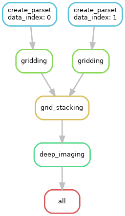

# Setting up a simple snakemake pipeline
----

This folder contains a simple example of a snakemake pipeline. The pipeline uses simple command-line commands to read and create text files. Each file represents a more complex data model (i.e. can be a folder) in an actual grid stacking pipeline.

The pipeline defined by the Snakefile:
	

For an explanation of running the pipeline and what happening, see the Sankefile!

First run the pipeline locally using a 'dry' run (requires snakemake to be installed):

	snakemake -np

A dry run builds the pipeline and write each rule to be executed in the standard output.

To visualize the pipeline run

	snakemake --dag | dot -Tpng > pipeline_graph.png & snakemake --rulegraph | dot -Tpng > rule_graph.png

this creates the pipeline graph and the graph for all tasks and saves it as a png image.

The pipeline runs a rule parallel maximum on two nodes, and so we can actually execute the pipeline by providing two cores:

	snakemake --cores 2

Note that before we run the pipeline, the output directory does not exist, snakemake automatically generates it when the pipeline is executed.

Now, if we run the pipeline, the following message should appear:

	Building DAG of jobs...
	Nothing to be done.
	
Since snakemake uses time-stamps to check if the pipeline outputs are modified since the last run, it only executes the parts needed.

Delete the `stacked_image.txt` file and run the pipeline again. Only the last two rules are executed!
